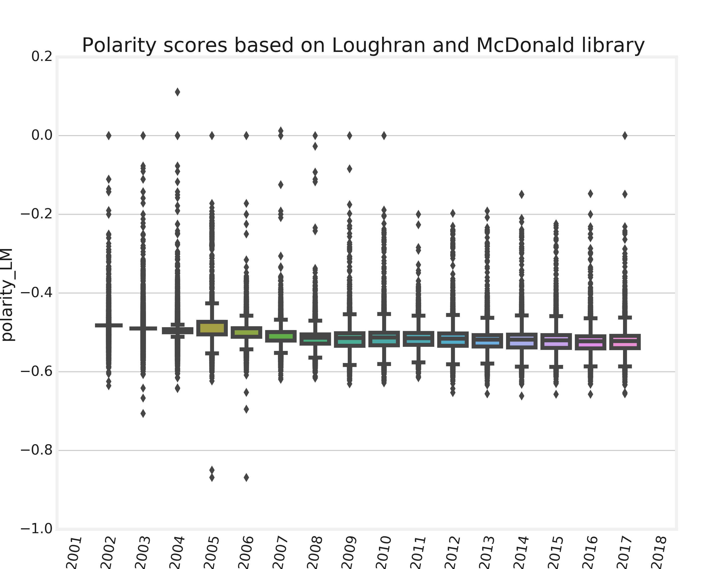

# Predicting the probability of corporate default using financial data and sentiment from annual reports
This project was done by <a href="https://github.com/jasminagk" target="_blank">Zhasmina Gyozalyan</a>, Alexandre Schade and <a href="https://github.com/faruman" target="_blank">Fabian Karst</a>.


Predict the probability of default crossing sentiment analysis with accounting data on publicly listed non-financial companies in the U.S.A between 2002 and 2018 using machine learning algorithms. 

The project involved the following steps:
- Preprocessing the data
- Performing textual analysis
- Describing the data
- Identifying outliers and the top 10% main features via random forest, applying oversampling techniques
- Finding the most appropriate machine learning algorithm
- Training and exporting the final machine learning model

The following chart provides a summary of the working process: 


## Preprocessing the data

As a first step, data about companies' financial situation taken from balance sheet, income statement and cash flow statement was taken. Overall, There were 974 variables, as the data was extremely detailed. As a result of exclusion of variables that were missing for more than 99% of observations, 440 were left. 

Afterwards, 23 financial ratios describing profitability, leverage, liquidity and activity were created. The ratios were calculated based on the accounting information from balance sheet, income statement and cash flow statement.

Macroeconomic indicators were collected from World Bank database. 

```
data_date = (datetime.datetime(2001, 1, 1), datetime.datetime(2018, 1, 1))
indicators = {"SL.UEM.TOTL.NE.ZS": "unemp", 
                   "NY.GDP.MKTP.KD.ZG" : "gdp_growth",
                  "FP.CPI.TOTL.ZG": "cpi", 
                  "GFDD.SM.01": "stockp_volatility", 
                  "BX.KLT.DINV.CD.WD": "fdi"}

usdata= wbdata.get_dataframe(indicators, country="USA", data_date=data_date)
usdata = usdata.reset_index()
usdata = usdata.rename(columns = {'index':'fyear'} )
usdata = usdata.astype(float)
```

## Performing textual analysis

The textual analysis is done in three main parts. 

First,all the direct HTML link to the company 10-K files available on the SEC webpage database, EDGAR were collected. (https://www.sec.gov/edgar/searchedgar/companysearch.html). 

Second, some preprocessing techniques using the bag-of-words approach were executed that will enabled keeping only the raw text of the fillings ready to be analyzed. 

Third, the average length of the sentences was computed but also the number of positive and negative words in each file based on two different libraries, one from Loughran and McDonald (2016) and one from Bing Liu, to compute a final polarity score. 

## Describing the data

The following graphs provide
a description of macroeconomic indicators' dynamics,

 

of the distribution of polarity scores extracted from companies' annual reports as a result of textual analysis,

 

as well as an overview of defaults by category.


## Identifying outliers and 44 main features, applying oversampling techniques
### Feature selection
The extracted dataset has a lot features (440 after initial cleaning). High dimensional datasets like this are very computational expensive to process with machine learning algorithms while a lot of the features do add very little new insights. 
To do this the following process was employed:
- An Extra Tree Forest is constructed from the original training sample 		(each decision trees learn how to best split the dataset into smaller and smaller subsets to predict the target value)
- For each decision tree, first the node importance for each node is calculated 	(gini importance). Afterwards the feature importance is calculated by dividing 	the sum of nodes importances of a feature by the overall nodes importances
- By averaging over all trees in the forest an feature importance ranking is 		created.

```
def reduce_components(X, X_name, y, top_n, do_plot):
    forest = ExtraTreesClassifier(n_estimators=250, random_state=0)
    forest.fit(X.loc[:, list(set(X.columns)-set(mergeOnColumns))], y)
    importances = forest.feature_importances_
    indices = np.argsort(importances)[::-1]
    topcols = [list(set(X.columns)-set(mergeOnColumns))[i] for i in list(indices[:top_n])]
    topimportances = [list(importances)[i] for i in list(indices[:top_n])]
    
    if do_plot:
        plt.figure(figsize=(21,7))
        plt.bar(topcols, topimportances)
        plt.xticks(rotation=90)
        plt.ylabel("Importance of feature")
        plt.title("Top {} features".format(top_n))
        plt.savefig("{}_top{}_features.png".format(X_name, top_n), transparent = True)
        plt.show()
    
    X_top = X.loc[:, ["cik"] + ["fyear"] + topcols]
    #X_top =  X.iloc[:,[list(X_all.columns).index("fyear")] + [list(X_all.columns).index("cik")] + [list(X_all.columns).index("conm")] + list(indices[:top_n])]
    return(X_top, topcols, topimportances)
 
nFeatures = 44
X_all, topcols, topimportances = reduce_components(X_all, "X_all", y, nFeatures, True)
```

### Outlier detection
Since there are a lot of outliers in the data, an Isolation Forest algorithm for implemented to identify anomalies. The percentage of outliers to be detected was  set to 10%.  (https://towardsdatascience.com/anomaly-detection-with-isolation-forest-visualization-23cd75c281e2)
```
from sklearn.ensemble import IsolationForest
to_model_columns=x_all.columns[3:46]
 
clf=IsolationForest(n_estimators=100, max_samples='auto', contamination=float(.1), \
                        max_features = 43, bootstrap=False, n_jobs=-1, random_state=42, verbose=0)
clf.fit(x_all[to_model_columns])
pred = clf.predict(x_all[to_model_columns])
x_all['anomaly']=pred
outliers=x_all.loc[x_all['anomaly']==-1]
```


### Rebalancing the dataset
As expected the dataset is really imbalanced. By Oversampling additional data points for the minority class are generated and thus a balanced dataset is generated.
- Random Oversampling:
	over-samples the minority class by picking samples at random with 			replacement
- Synthetic Minority Over-sampling:
	over-samples the minority class by generating new artificial samples that 		are between two of the samples of the target class.
```
for i in range(len(dfs)):
 
    #Random naive over-sampling
    from imblearn.over_sampling import RandomOverSampler
 
    X_resampled, y_resampled = RandomOverSampler(random_state=0).fit_resample(dfs[i], y_train)
    X_resampled = pd.DataFrame(X_resampled, columns = dfs[i].columns)
    y_resampled = pd.DataFrame(y_resampled, columns=["bnkrpt"])
        
    X_resampled[X_all_train.columns].to_csv("{}_RNOS.csv".format(dfs_names[i]))
    y_resampled.to_csv("y{}_RNOS.csv".format(dfs_names[i][1:]))
    
    #Synthetic minority oversampling
    from imblearn.over_sampling import SMOTE
    
    X_resampled, y_resampled = SMOTE().fit_resample(dfs[i], y_train)
    X_resampled = pd.DataFrame(X_resampled, columns = dfs[i].columns)
    y_resampled = pd.DataFrame(y_resampled, columns=["bnkrpt"])
        
    X_resampled[X_all_train.columns].to_csv("{}_SMOTEOS.csv".format(dfs_names[i]))
    y_resampled.to_csv("y{}_SMOTEOS.csv".format(dfs_names[i][1:]))
```


## Find the most appropriate machine learning algorithm
To find the best machine learning algorithm 5-fold cross-validation was employed to validate the stability of the model. As success measure the F1 Score was choosen, as it balances precision (how many of the predicted positive are actual positive) and recall (how many of the actual positives are labelled as true positives.
The following machine learning algorithms were tested:
- Logistic Regression (https://towardsdatascience.com/an-introduction-to-logistic-regression-8136ad65da2e)
- Random Forest (https://towardsdatascience.com/understanding-random-forest-58381e0602d2)
- Adaptive Boosting (https://towardsdatascience.com/boosting-algorithm-adaboost-b6737a9ee60c)
- Naïve Bayes (https://towardsdatascience.com/naive-bayes-explained-9d2b96f4a9c0)
- K-Nearest Neighbour (https://towardsdatascience.com/knn-k-nearest-neighbors-1-a4707b24bd1d)
- Decision Tree (https://towardsdatascience.com/decision-tree-classification-de64fc4d5aac)

```
#Define machine learning function with parameters
LogReg = Pipeline([
            ('sampling', RandomOverSampler()),
            ('classification', LogisticRegression(solver='lbfgs', random_state=0))])
LogReg_para = {}
RandF = Pipeline([
            ('sampling', RandomOverSampler()),
            ('classification', RandomForestClassifier(random_state=0))])
RandF_para = {'classification__n_estimators':[20, 50, 100, 200, 400, 800], 'classification__max_depth':[2, 5, 10, 20]}
AdaBoost = Pipeline([
            ('sampling', RandomOverSampler()),
            ('classification', AdaBoostClassifier(random_state=0))])
AdaBoost_para = {'classification__n_estimators':[20, 50, 100, 200, 400, 800]}
NaivBay = Pipeline([
            ('sampling', RandomOverSampler()),
            ('classification', GaussianNB())])
NaivBay_para = {}
Knn = Pipeline([
            ('sampling', RandomOverSampler()),
            ('classification', KNeighborsClassifier(algorithm='auto', leaf_size=30, metric='minkowski'))])
Knn_para = {'classification__n_neighbors': (10, 15, 25)}
DecTree = Pipeline([
            ('sampling', RandomOverSampler()),
            ('classification', DecisionTreeClassifier())
            ])
DecTree_para = {}

score={'AUC':'roc_auc', 
           'RECALL':'recall',
           'PRECISION':'precision',
           'F1':'f1’}

clasifier_names = ["Logistic Regression", "Random Forest", "Adaptive Boosting", "Naive Bayes", "K-nearest neighbours", "Decision Tree"]
classifiers = [LogReg, RandF, AdaBoost, NaivBay, Knn, DecTree]
parameters = [LogReg_para, RandF_para, AdaBoost_para, NaivBay_para, Knn_para, DecTree_para]

 
results = list()
 
#run the gridsearch to find the best algorithm
for i in range(len(classifiers)):
    clf = GridSearchCV(classifiers[i], parameters[i], cv=5, scoring=score, n_jobs=-1, refit=False, return_train_score=True)
    clf.fit(X_train, y_train)
    results.append([clasifier_names[i], clf.cv_results_])
    print(clasifier_names[i])
    print(clf.cv_results_)
```

## Train and export the final machine learning model
The best performing algorithm determined by gridsearch was large random forest classifier. A random forest with 800 trees and a max depth of 20 had the largest F1 score on all data sets. It was trained on the complete training dataset and evaluated on the unused test dataset to get the final performance evaluation.
```
#train model
clf = RandomForestClassifier(random_state=randomstate, n_estimators=800, max_depth=20)
clf.fit(X_train, y_train)

#test model
y_pred = clf.predict(X_test)

#calculate scores
result = {}
result["acc"] = accuracy_score(y_test, y_pred)
result["prec"] = precision_score(y_test, y_pred)
result["rec"] = recall_score(y_test, y_pred)
result["f1"] = f1_score(y_test, y_pred)

#print scores
for key in result.keys():
    print("{}: {}".format(key, result[key]))

#save classifier
filename = r'...\prediction_model.sav'
pickle.dump(clf, open(filename, 'wb'))
```